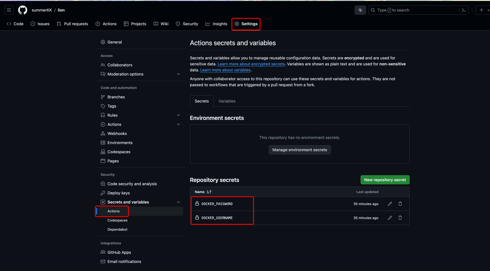
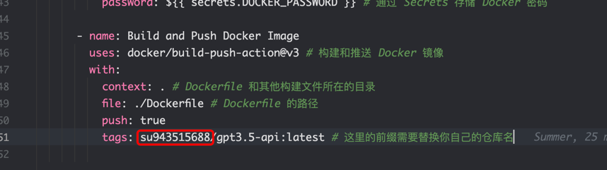
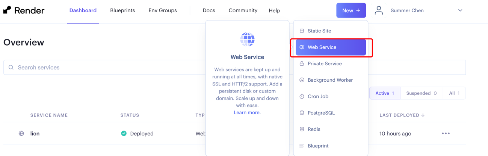
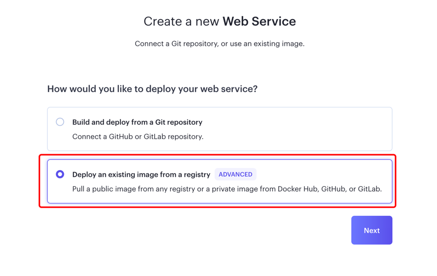
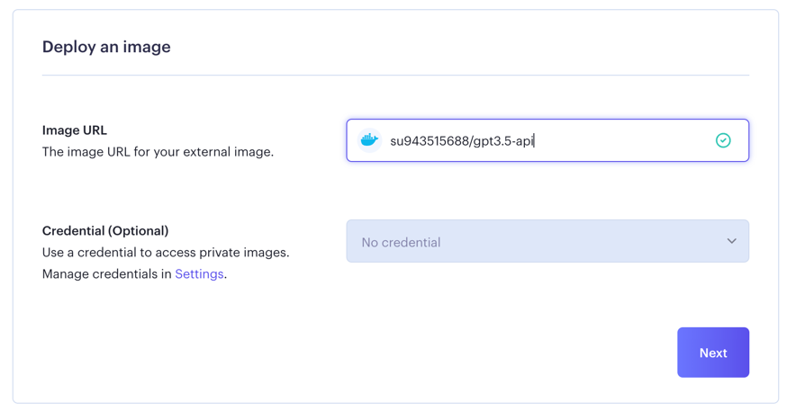
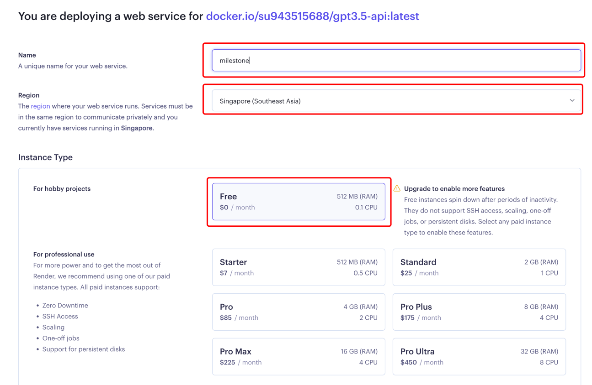
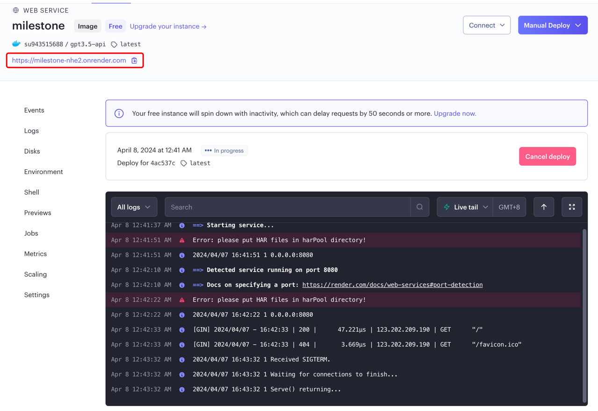
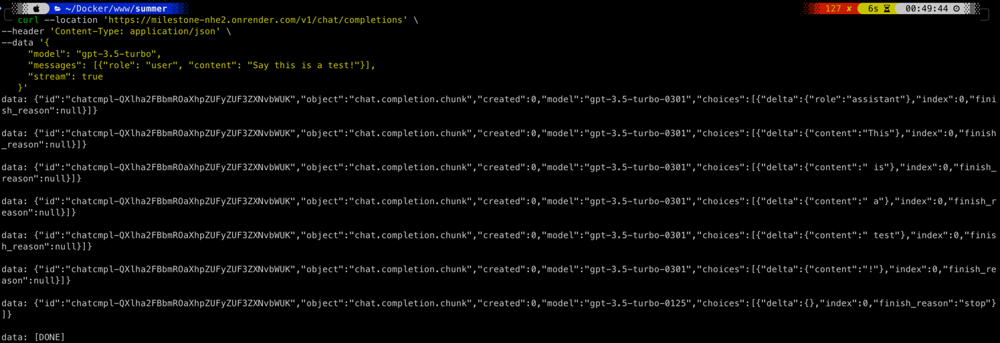
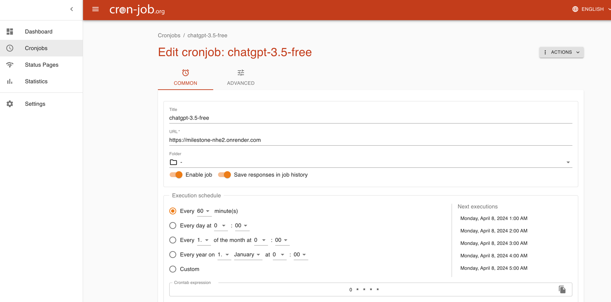

## 开始

- 因为 [aurora](https://github.com/aurora-develop/aurora?tab=readme-ov-file) 仓库已经被`Render`
  标识,导致无法使用`Render`
  构建
- `Render`用起来确实很方便,每个月有`750`小时的免费额度,还能部署到`新加坡`,速度也挺快
- 所以我们通过自己构建镜像的方式来白嫖`chatgpt api`
- 如果不需要在`Render`上面构建请去访问 [aurora](https://github.com/aurora-develop/aurora?tab=readme-ov-file)
  项目,那里有更多的构建方式

## 项目流程

1. 使用`GitHub Actions`对 [aurora](https://github.com/aurora-develop/aurora?tab=readme-ov-file) 项目进行编译,得到可执行二进制文件
2. 然后构建镜像上传到`Docker Hub`
3. 在`Render`上面通过`Docker镜像`构建服务
4. 白嫖 (白嫖使我快乐)

## 准备

- [Docker Hub 账号](https://hub.docker.com/)
- fork 本项目
- [Render 账号](https://dashboard.render.com/)

## 设置

- fork 项目后添加记得开启`GitHub Actions`,我们需要它来编译`Go`代码
  ```text
  GitHub Actions 在 fork 的项目中默认是禁用的，这是出于安全考虑和资源使用的目的。当用户 fork 一个项目时，原始项目的所有
  GitHub Actions 不会自动在 fork 的项目中运行。

      但是，如果用户想要在 fork 的项目中启用 GitHub Actions，他们可以手动启用它们。他们可以通过以下步骤来启用 GitHub Actions：
      
      打开 fork 的项目页面。
      
      点击页面顶部的 "Actions" 选项卡。
      
      在弹出的窗口中，点击 "I understand my workflows, go ahead and enable them" 按钮。
      
      此时，GitHub 将启用 fork 的项目中的 GitHub Actions，并允许用户运行这些工作流程。
      
      需要注意的是，虽然用户可以在 fork 的项目中手动启用 GitHub Actions，但仍然会受到一些限制。例如，fork 的项目可能会受到 GitHub Actions 的资源限制，以及一些安全策略的限制。
      ```

- 在项目里面设置 `secrets`,我们需要用它把打包好的镜像上传到`Docker Hub`

  

- 修改`workflow`

  

## 实施

- 给项目随便提交一个`commit`,触发`Actions`[构建](https://github.com/summerKK/lion/actions/runs/8589994501)

- 构建完成后你的`Docker Hub`会多出来一个镜像`xxx/gpt3.5-api`

- 启动服务

  
  
  
  
    - 地区记得选`新加坡`,方案选`free`

- 服务构建成功

  

- 测试
  ```bash
  curl --location '你的域名/v1/chat/completions' \
  --header 'Content-Type: application/json' \
  --data '{
  "model": "gpt-3.5-turbo",
  "messages": [{"role": "user", "content": "Say this is a test!"}],
  "stream": true
  }'
  ```
  

## 增加定时任务

- `Render`构建的免费项目如果长时间没激活会自动回收.我们可以加一些定时任务来不断访问项目,让项目不会自动关闭
- 申请 [cron-job](https://cron-job.org/)
- 配置定时任务

  

## 感谢

- 感谢[aurora](https://github.com/aurora-develop/aurora?tab=readme-ov-file)项目的开源,让我们可以白嫖`gpt`😋
- 可以给[aurora](https://github.com/aurora-develop/aurora?tab=readme-ov-file)多点点`star`